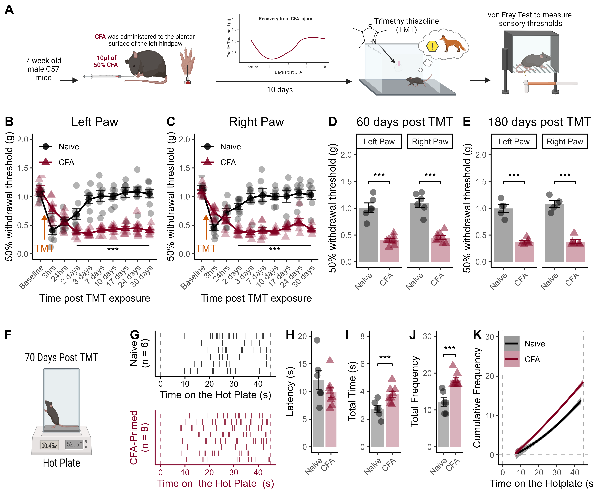

---
output:
  pdf_document: default
  html_document: default
---
# Figure 2 {-}

```{r, echo = FALSE, warning = FALSE, message = FALSE}
library(tidyverse)
library(reshape2)
library(rstatix)


```

**Figure 2. *A history of injury facilitates chronification of TMT-induced mechanical hypersensitivity.*** (A) Timeline for behavioral testing: Naive for CFA-primed mice were exposed to TMT for five-minutes, and von Frey (VF) paw withdrawal thresholds were repeatedly measured to investigate TMT-induced alterations in sensory thresholds. (B) VF raw withdrawal thresholds after TMT in the previously injured hind paw. (C) VF paw withdrawal thresholds after TMT in the right (not injured) hindpaw. (D) VF paw withdrawal thresholds 60 days after the single exposure to TMT. (E) VF paw withdrawal thresholds 180 days after the single TMT session. (F) To further characterize the nature of the persistent hypersensitive phenotype, we used a 45 second hotplate test 70 days after the TMT exposure. (G) Raster plots showing nociceptive responses (e.g., shaking, flinching) during the hot plate test. (H) Latency to exhibit the first nociceptive response on the hot plate. (I) Mice with a history of injury spent more time exhibiting nociceptive responses. (J) The frequency of nociceptive behaviors on the hotplate was also higher for CFA-primed mice. (K) Cumulative frequency of nociceptive responses across the 45 second hot plate test. Data displayed as mean +/- SEM. \*\*\* indicates *p* \< 0.001.

```{r, echo = FALSE, warning = FALSE, message = FALSE}
data <- read_csv("Data/TMT_VF_data.csv")
data$Condition <- as.character(data$Condition)
data$Condition <- factor(data$Condition, levels=unique(data$Condition))

Naive <- data[1:8, ]
CFA_10D <- data[9:16, ]

data2 <- rbind(Naive, CFA_10D)
data3 <- data2[1:22]

Left_Data <- as.data.frame(data3) %>%
  dplyr::select(1:3,5,7,9,11,13,15,17,19,21)%>%
  rename("Baseline" = "BL_L", 
          "3 hours" =  "L_3hrs", 
          "24 hours" = "L_24hrs", 
          "48 hours" = "L_48hrs", 
          "72 hours" = "L_72hrs",
          "7 days" = "L_7D",
         "10 days" = "L_10D",
         "17 days" =  "L_17D", 
         "24 days" = "L_24D",
         "31 days" = "L_31D")

Right_Data <- as.data.frame(data3) %>%
  dplyr::select(1,2,4,6,8,10,12,14,16,18,20,22)%>%
  rename("Baseline" = "BL_R", 
          "3 hours" =  "R_3hrs", 
          "24 hours" = "R_24hrs", 
          "48 hours" = "R_48hrs", 
          "72 hours" = "R_72hrs",
          "7 days" = "R_7D",
         "10 days" = "R_10D",
         "17 days" =  "R_17D", 
         "24 days" = "R_24D",
         "31 days" = "R_31D")

no_1D <- data[1:16,]

```

## Von Frey Paw Sensitivity After TMT {-}

```{r}
# Left
a <- Left_Data %>%
  melt(id.vars = c("ID", "Condition")) %>%
  na.omit()

anova_test(data = a, within = variable, dv = value, between = Condition, wid = ID)
```

```{r}
# Right
a <- Right_Data %>%
  melt(id.vars = c("ID", "Condition")) %>%
  na.omit()

anova_test(data = a, within = variable, dv = value, between = Condition, wid = ID)
```

We measured von Frey (VF) paw withdrawal thresholds after TMT exposure to assess whether synthetic predator threat alters peripheral mechanical sensitivity (Figure 2A). A single five-minute exposure to TMT induced changes in paw withdrawal thresholds in the left (F9,126 = 21.23, p < 0.001, Figure 2B) and right (F9,126 = 17.56, p < 0.001, Figure 2C) hind paws that differed for pain-naive and CFA primed mice (Left hind paws: F9,126 = 30.86 p < 0.001; Right hind paws: F9,126 = 18.13, p < 0.001).

```{r}
## Left Paws
a <- Left_Data %>%
  melt(id.vars = c("ID","Condition","Baseline")) %>%
  mutate(Perc_BL = value / Baseline * 100) 
  
anova_test(data = a, dv = Perc_BL, between = Condition, within = variable, wid = ID)

a %>%
  dplyr::group_by(Condition) %>%
  pairwise_t_test(value ~ variable) %>%
  filter(group1 == "Baseline")


## Right Paws
a <- Right_Data %>%
  melt(id.vars = c("ID","Condition","Baseline")) %>%
  mutate(Perc_BL = value / Baseline * 100) 
  
anova_test(data = a, dv = Perc_BL, between = Condition, within = variable, wid = ID)

a %>%
  dplyr::group_by(Condition) %>%
  pairwise_t_test(value ~ variable) %>%
  filter(group1 == "Baseline")
```


For pain-naive mice, TMT-induced mechanical hypersensitivity resolved three days after exposure (left hind paws: all p > 0.32; right hind paws: all p > 0.15, relative to baseline measurements). In contrast, CFA-primed mice exhibited a persistent state of mechanical hypersensitivity after TMT exposure that did not resolve. The ongoing mechanical hypersensitivity expressed by CFA-primed mice was present both in the previously injured (left) hind paw (all p < 0.012 relative to baseline measurements) and in the not-previously-injured right hind paw (all p < 0.001 relative to baseline measurements). 

```{r}
# 60 Days
t.test(data = no_1D,  L_60D ~ Condition, var.equal = T)
t.test(data = no_1D, R_60D ~ Condition, var.equal = T)
```

Sixty days after the single TMT exposure, CFA-primed mice continued to exhibit lower paw withdrawal thresholds than pain-naive controls (F1,12 = 112.02, p < 0.001, Figure 2D), and the hypersensitivity did not differ between the right and left hind paws (p = 0.68). 

```{r}
# 180 Days
t.test(data = no_1D, L_180D ~ Condition, var.equal = T)
t.test(data = no_1D, R_180D ~ Condition, var.equal = T)
```

The hypersensitivity remained detectable among CFA-primed mice 180 days after the single exposure (F1,9 = 165.45, p < 0.001, Figure 2E) for both hind paws.

## Hot Plate Test {-}

```{r,get_LE_BL_HP_data, echo = FALSE, message = FALSE, warning=FALSE}
# Get data and clean up start times
get_data_fun <- function(df_name, csv){
  df_name <- read_csv(csv)
  start_times <- df_name[df_name$Behavior == "start", ]
  number_of_behavs <- df_name %>%
  group_by(ID) %>%
  summarise(
    n=n()
  )
  df_name$dum <- rep(start_times$Start, number_of_behavs$n)
  df_name$Start_clean <- df_name$Start - df_name$dum
  df_name$Stop_clean <- df_name$Stop - df_name$dum
  return(df_name)
}

data <- get_data_fun(data,"Data/Crystal_score.csv")

# Get info about CFA conditions
junk <- read_csv("Data/Long_HP_Conditions_info.csv")

junk$CFA <- as.character(junk$CFA)
junk$CFA <- factor(junk$CFA,levels = unique(junk$CFA))

BL_number_of_Behavs <- data %>%
  group_by(ID) %>%
  summarise(
    n=n()
  )
data$CFA <- rep(junk$CFA, BL_number_of_Behavs$n)

rm(BL_number_of_Behavs)

junk <- junk[junk$CFA != "CFA_1_day", ]
```

```{r}
# Latency to shake / flick
a <- data %>%
  group_by(ID,CFA) %>%
  filter(Behavior == "shake") %>%
  filter(CFA != "CFA_1_day") %>%
  summarise(
    min=min(Start_clean)
  )

t.test(data = a, min ~ CFA,var.equal = TRUE)
```

There was no group difference in the latency to first nociceptive response (p = 0.25 Figure 2G,H).

```{r}
# Total time spent exhibiting nociceptive responses
a <- data %>%
  group_by(ID,CFA) %>%
  filter(Behavior == "shake") %>%
  filter(CFA != "CFA_1_day") %>%
  summarise(
    sum=sum(Duration)
  )

t.test(data = a, sum ~ CFA,var.equal = TRUE)
```

CFA-primed mice spent significantly more time displaying pain-related behaviors (t12 = 3.17, p = 0.008, Figure 2I) 

```{r}
# Frequency of nociceptive responses
a <- data %>%
  group_by(ID,CFA) %>%
  filter(Behavior == "shake") %>%
  filter(CFA != "CFA_1_day") %>%
  summarise(
    n=n()
  )

t.test(data = a, n ~ CFA,var.equal = TRUE)
```

and exhibited a higher frequency of pain responses (t12 = 4.64, p < 0.0001, Figure 2J,K) during the 45-second task.

In separate experiments, we replicated the same experimental setup, but exposed mice to the odor butyric acid (an odor that is repugnant but not fear-inducing) instead of TMT. We found that mice did not exhibit freezing behavior or mechanical hypersensitivity after butyric acid exposure (Figure S3), highlighting that the behavioral responses to TMT represent a specific fear response, and are not related to the other elements of the testing procedures.


