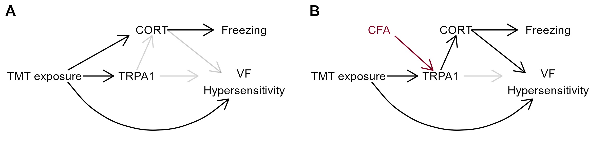

# Figure 7 {-}

```{r, echo = FALSE, warning = FALSE, message = FALSE}
library(tidyverse)
library(reshape2)
library(rstatix)


```

**Figure 7. *Proposed model of systems involved in behavioral responses to TMT.*** (A) Observed responses to TMT in pain-naive male mice. TMT induces two pharmacologically dissociable behavioral responses: Freezing behavior during the session and mechanical hypersensitivity after the exposure. The hormonal stress response entirely mediates freezing behavior, but corticosterone during TMT is not required for the expression of subsequent mechanical hypersensitivity. TRPA-1 signalling did not alter freezing behavior or mechanical sensitivity after TMT for naive mice, suggesting that, TMT induces mechanical hypersensitivity via corticosterone and TRPA-1-independent mechanisms (B) CFA-priming enhanced TMT-induced corticosterone levels, and this enhancement was blocked by pharmacological inhibition of TRPA-1 signalling. Together, these findings suggest that CFA-priming alters TRPA-1 signalling during TMT exposure to facilitate an enhanced corticosterone response, which causes enhanced freezing behavior during the session and a prolongation of mechanical sensitivity after the exposure.

The current results give rise to several novel insights about responses to TMT and modulation by prior experience with pain. Specifically, our findings indicate that TMT induces two pharmacologically dissociable behavioral responses: Freezing and mechanical hypersensitivity (Figure 7A). The hormonal stress response entirely mediates freezing, whereas hypersensitivity after TMT persists even when the stress response is blocked.

CFA-primed mice exhibit enhanced freezing and corticosterone release during TMT presentation, and prolonged sensitivity afterward. The freezing response can be entirely blocked by inhibition of glucocorticoid synthesis, and antagonism of TRPA-1 signaling normalized both freezing and circulating corticosterone among mice with a history of CFA injury (Figure 7B). These findings suggest that CFA-priming regulates TRAP-1 signaling to enhance threat-induced corticosterone release and the associated behavioral output - freezing. The enhanced hormonal stress response also modulated the prolongation of mechanical sensitivity after TMT without preventing TMT-induced hypersensitivity.

