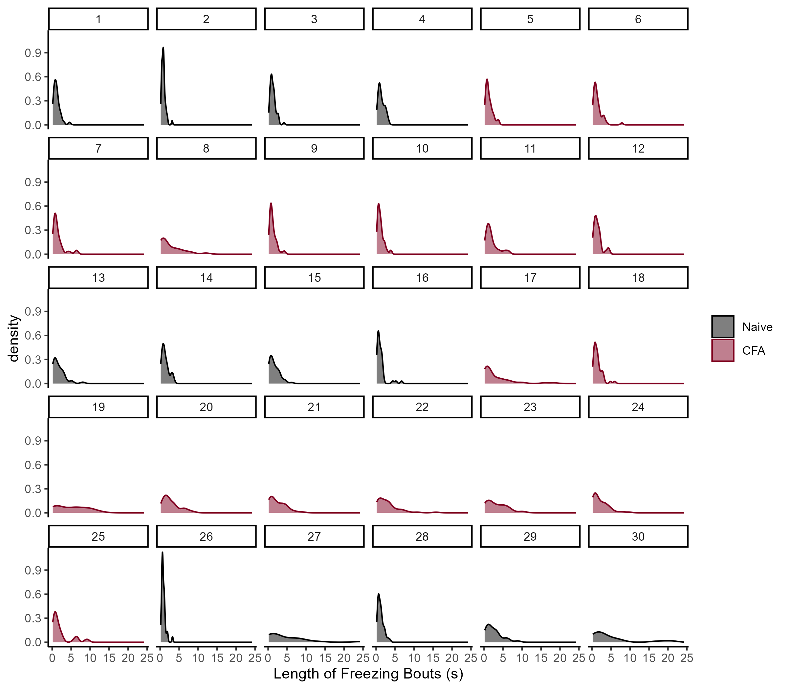

# Supplemental Figure 2 {-}

```{r, echo = FALSE, warning = FALSE, message = FALSE}
library(tidyverse)
library(reshape2)
library(rstatix)


```

**Supplemental Figure 2**. Distributions of the lengths of bouts of freezing during TMT for the 30 mice shown in Figure 1 of the main text. For every individual, the distributions of freezing episodes are right-skewed, indicating that mice exhibit many shorter bouts of freezing along with fewer longer episodes.

```{r, echo = FALSE, message = FALSE, warning = FALSE}
# Get data
data <- read_csv("Data/OG_CFA_TMT.csv")

# Clean up start times

start_times <- data[data$Behavior == "start", ]

number_of_behavs <- data %>%
  group_by(ID) %>%
  summarise(
    n=n()
  )

data$dum <- rep(start_times$Start, number_of_behavs$n)
data$Start_clean <- data$Start - data$dum
data$Stop_clean <- data$Stop - data$dum

# Attach conditions data
conditions_data <- read_csv("Data/OG_40_conditions.csv")
data$CFA <- rep(conditions_data$CFA,number_of_behavs$n)
data$PGE2 <- rep(conditions_data$PGE2,number_of_behavs$n)
data$CFA <- as.character(data$CFA)
data$CFA <- factor(data$CFA,levels=unique(data$CFA))
data$PGE2 <- as.character(data$PGE2)
data$PGE2 <- factor(data$PGE2,levels=unique(data$PGE2))

a <- data %>% 
  filter(CFA != "CFA_1D") %>%
  filter(PGE2 != "PGE2") %>%
  filter(Behavior == "freeze")
```

```{r}
library(moments)
skew_df <- a %>%
  group_by(ID) %>%
  summarise(
    skew = skewness(Duration)
  )

t.test(skew_df$skew, mu = 0, alternative = "greater")
```

The distributions of bout durations of freezing responses are heavily right-skewed during TMT presentation (t~29~ = 14.66, p \< 0.001). For this reason, aggregating the behavior by calculating the mean length of freeze for each mouse would not be statistically appropriate. Instead, we aggregated all the freezing episodes for each condition, and compared the resultant distributions between groups in our analyses.


