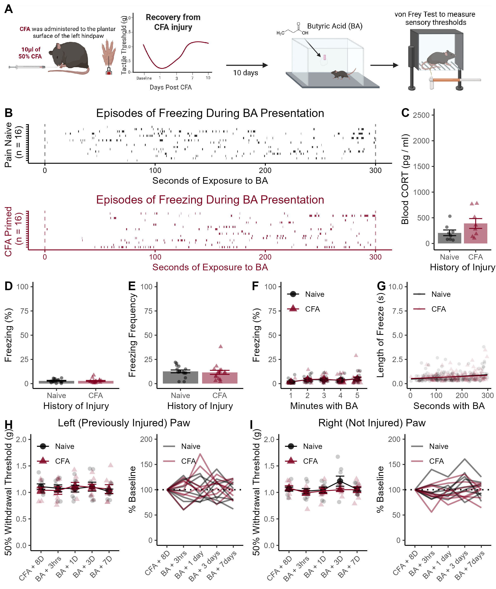

# Supplemental Figure 3 {-}

```{r, echo = FALSE, warning = FALSE, message = FALSE}
library(tidyverse)
library(reshape2)
library(rstatix)


```

**Supplemental Figure 3**. Behavioral, hormonal, and sensory responses to butyric acid presentation. (A) Timeline of experimental proceedings. Mice were placed in an apparatus with 35 $\mu l$ of 10% butyric acid 10 days after CFA administration. (B) Raster plots of individual freezing episodes during the butyric acid session. (C) Circulating levels of CORT 30 minutes after butyric acid presentation. (D) Average freezing during butryic acid was very low. (E) Number of freezing episodes during the five-minute exposure to butyric acid. (F) The amount of time spent freezing did not increase across the five minutes of the test. (G) There was no significant increase in length of freezing episodes across the five minute session. (H) There was no change in mechanical thresholds at the site of previous CFA injury after the butyric acid exposure, or (I) the opposite (not previously injured) hind paw. Data presented as mean value +/- SEM

## CORT Levels {-}

```{r, echo = FALSE, message = FALSE, warning = FALSE}
Cort_data <- read_csv("Data/CORT_2025_R.csv")
Cort_data$CFA <- factor(Cort_data$CFA, levels = unique(Cort_data$CFA))
Cort_data <- Cort_data[Cort_data$Expt == "BA", ]
```

```{r}
t.test(data = Cort_data, CORT ~ CFA, var.equal = T)
```

A history of CFA injury did not increase circulating CORT 30 minutes after the butyric acid session (p = 0.12, Figure S3C).

```{r, echo = FALSE, message = FALSE, warning = FALSE}
# Get data
data <- read_csv("Data/BA_Freezing.csv")

# Clean up start times

start_times <- data[data$Behavior == "start", ]

number_of_behavs <- data %>%
  group_by(ID) %>%
  summarise(
    n=n()
  )

data$dum <- rep(start_times$Start, number_of_behavs$n)
data$Start_clean <- data$Start - data$dum
data$Stop_clean <- data$Stop - data$dum

# Attach conditions data
conditions_data <- read_csv("Data/BA_Conditions.csv")
data$CFA <- rep(conditions_data$CFA,number_of_behavs$n)
data$CFA <- as.character(data$CFA)
data$CFA <- factor(data$CFA,levels=unique(data$CFA))

Exp_1_CFA.N <- data
```

## Time Spent Freezing During TMT {-}

```{r}
b <- Exp_1_CFA.N  %>%
  filter(Behavior == "freeze") %>%
  group_by(ID,CFA) %>%
  summarise(
    sum=sum(Duration),
    Number=n(),
  ) %>%
  mutate(Perc = (sum / 300)*100) 

t.test(Perc~CFA,data=b,var.equal=TRUE)
```

There was no group difference in the amount of time spent freezing (p = 0.83, Figure S3D).

## Freezing Frequency During TMT {-}

```{r}
b <- Exp_1_CFA.N  %>%
  filter(Behavior == "freeze") %>%
  group_by(ID,CFA) %>%
  summarise(
    sum=sum(Duration),
    Number=n(),
  )

t.test(Number~CFA,data=b,var.equal=TRUE)
```

There was no difference in frequency of freezing (p = 0.70, Figure S3E)

## Freezing Each Minute With TMT {-}

```{r}
a <- Exp_1_CFA.N %>%
  na.omit() %>%
  mutate(Bins = cut(
    Start_clean,
    breaks = 5,
    labels=c("1","2","3","4","5")
  )) %>%
  group_by(ID, Behavior, CFA, Bins) %>%
  summarise(
    sum = sum (Duration)
  ) %>%
  mutate(Perc = (sum / 60)*100 ) %>%
  filter(Behavior == "freeze")

res <- aov(data = a, Perc ~ Bins)
summary(res)
```


Unlike the behavioral patterns observed during TMT presentation, there was no increase in the time spent freezing (p = 0.16, Figure S3F)

## Linear Relationship Between Time and Length of Freeze {-}

```{r}
b <- lm(Duration~Start_clean * CFA, data=Exp_1_CFA.N)
summary(b)
```

There was no increase in the length of freezing episodes (p = 0.50, Figure S3G) across the session.

## Von Frey Paw Sensitivity {-}

```{r, echo = FALSE, warning = FALSE, message = FALSE}
data <- read_csv("Data/BA_VF_R.csv")
data$CFA <- factor(data$CFA, levels = c("Naive", "CFA"))
data$Test <- factor(data$Test, levels = unique(data$Test))
```

```{r}
data %>%
  filter(Paw == "Left") %>%
  anova_test(dv =  VF, within = Test, between = CFA, wid = ID)

data %>%
  filter(Paw == "Right") %>%
  anova_test(dv =  VF, within = Test, between = CFA, wid = ID)
```

There were no changes in mechanical thresholds after butyric acid (Left paw: all p > 0.84; Right paw: all p > .16, Figure S3H & I, respectively).


