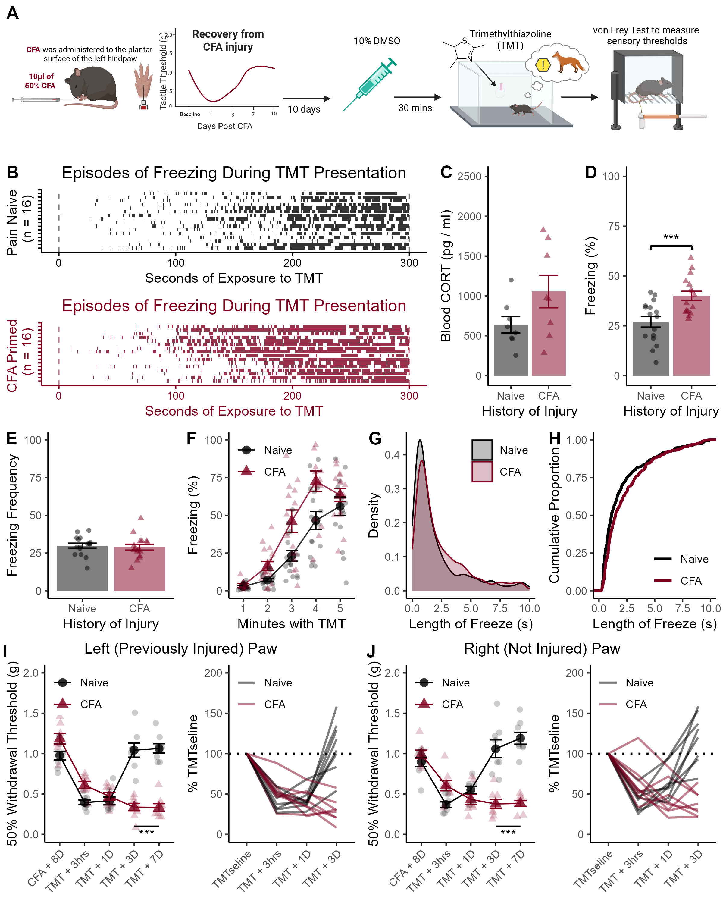

# Supplemental Figure 5 {-}

```{r, echo = FALSE, warning = FALSE, message = FALSE}
library(tidyverse)
library(reshape2)
library(rstatix)


```

**Supplemental Figure 5**. Behavioral, hormonal and sensory responses to TMT after DMSO administration. (A) Timeline of experimental proceedings. Injury-naive controls and mice that had previously been injured with CFA and allowed to recover were administered 10% DMSO 30 minutes before exposure to TMT. (B) Raster plots of individual bouts of freezing during TMT exposure. (C) Blood levels of CORT 30 minutes after TMT. (D) Average time spent freezing during TMT. (E) Time spent freezing broken down by minute. (F) Number of freezing episodes during TMT. (G) Density plot of individual bouts of freezing during TMT. (H) Cumulative proportion of individual bouts of freezing across the session. (I) Mechanical hypersensitivity among mice with a history of CFA at the site of previous injury. (J) Expression of mechanical hypersensitivity was also expressed in the contralateral (no previously injured) hind paw for mice with a history of CFA. Data presented as mean value +/- SEM.

```{r, echo = FALSE, warning = FALSE, message = FALSE}
Cort_data <- read_csv("Data/CORT_2025_R.csv")
Cort_data$CFA <- factor(Cort_data$CFA, levels = unique(Cort_data$CFA))
Cort_data <- Cort_data[Cort_data$Expt == "DMSO", ]
```

## CORT Levels {-}

```{r}
t.test(data = Cort_data, CORT ~ CFA, var.equal = T)
```

The increased levels of blood-CORT among CFA-primed mice was not significant (p = 0.08).

## Time Spent Freezing During TMT {-}

```{r, echo = FALSE, warning = FALSE, message = FALSE}
# Get data
data <- read_csv("Data/DMSO_Frz.csv")

# Clean up start times

start_times <- data[data$Behavior == "start", ]

number_of_behavs <- data %>%
  group_by(ID) %>%
  summarise(
    n=n()
  )

data$dum <- rep(start_times$Start, number_of_behavs$n)
data$Start_clean <- data$Start - data$dum
data$Stop_clean <- data$Stop - data$dum

# Attach conditions data
conditions_data <- read_csv("Data/DMSO_Conditions.csv")
data$CFA <- rep(conditions_data$CFA,number_of_behavs$n)
data$CFA <- as.character(data$CFA)
data$CFA <- factor(data$CFA,levels=unique(data$CFA))

Exp_1_CFA.N <- data
```

```{r}
b <- Exp_1_CFA.N  %>%
  filter(Behavior == "freeze") %>%
  group_by(ID,CFA) %>%
  summarise(
    sum=sum(Duration),
    Number=n(),
  ) %>%
  mutate(Perc = (sum / 300)*100) %>%
  mutate(Av_DUR = (sum / Number)) 
  
t.test(Perc~CFA,data=b,var.equal=TRUE)
```

CFA-primed mice spent more time freezing that injury-naive controls (t~30~ = 3.65, p <0.001, figure S5D & E)

## Frequency of Freezing During TMT {-}

```{r}
b <- Exp_1_CFA.N  %>%
  filter(Behavior == "freeze") %>%
  group_by(ID,CFA) %>%
  summarise(
    sum=sum(Duration),
    Number=n(),
  ) %>%
  mutate(Perc = (sum / 300)*100)

t.test(Number~CFA,data=b,var.equal=TRUE)
```

There was no difference in freezing frequency (p = 0.67, Figure S5F).


## Length of Freezing Bouts {-}

```{r, warning = FALSE, message = FALSE}
a <- data %>%
  filter(Behavior == "freeze")

cfa_durations <- a$Duration[a$CFA == "CFA"]
naive_durations <- a$Duration[a$CFA == "Naive"]

library(kSamples)
ad.test(cfa_durations, naive_durations)
```


The length of freezing episodes were longer for CFA-primed mice (D = 0.14, p \< 0.001; Figure S5G, H). Relative to non-injured controls

## Von Frey Sensitivity {-}

```{r, echo = FALSE, message = FALSE, warning = FALSE}
data <- read_csv("Data/DMSO_VF_R.csv")
data$CFA <- factor(data$CFA, levels = c("Naive", "CFA"))
data$Test <- factor(data$Test, levels = unique(data$Test))
```

```{r}
data %>%
  filter(Paw == "Left") %>%
  anova_test(dv = VF, between = CFA, within = Test, wid = ID)

data %>%
  filter(Paw == "Right") %>%
  anova_test(dv = VF, between = CFA, within = Test, wid = ID)
```
CFA-primed mice exhibited prolonged hypersensitivity in both the previously injured and the contralateral (not injured) hind paws after TMT exposure (Left Paw: F~4,56~ = 39.82, p \< 0.001; Right Paw: F~4,56~ = 29.12, p \< 0.001; Figure S5I & J, respectively)


